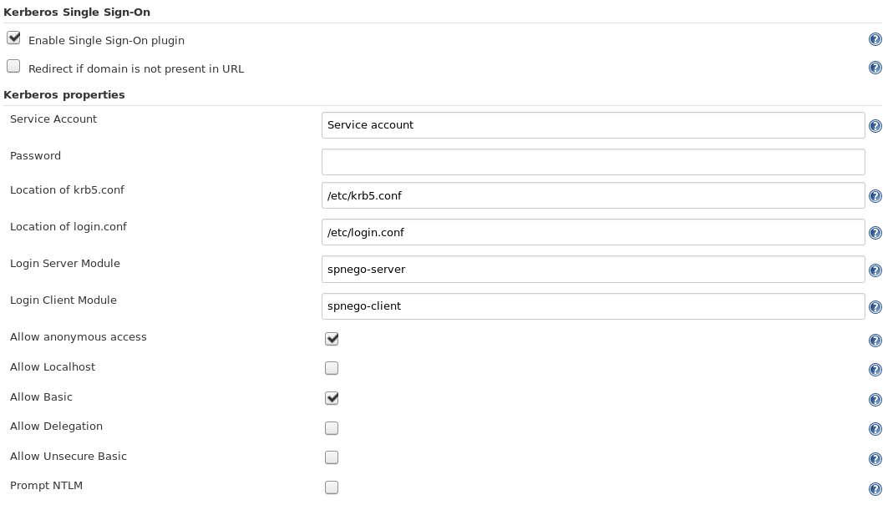

[](https://ci.jenkins.io/job/Plugins/job/kerberos-sso-plugin/job/master/)
[](https://github.com/jenkinsci/kerberos-sso-plugin/graphs/contributors)
[](https://plugins.jenkins.io/kerberos-sso)
[](https://github.com/jenkinsci/kerberos-sso-plugin/releases/latest)
[](https://plugins.jenkins.io/kerberos-sso)

# Kerberos SSO plugin

This plugin authenticates a user in Jenkins based on kerberos ticket negotiation.

## Summary

It reads user's Kerberos ticket and uses it to log the user
into Jenkins. It is designed to work really well with the Active
Directory plugin. It can also redirect users that omit specifying a
domain in their request.

The authentication can be bypassed for specific request by setting a
Bypass-Kerberos header in the request. It doesn't matter which value it
has, the user will be authenticated as anonymous.

The Plugin can be configured to permit unauthenticated requests and
authenticated only if requested. Otherwise, authentication is performed
for every request.

## Prerequisites

-   In order to use the plugin, you need a Kerberos environment. If you
    do, locating the files the plugin needs is the most time consuming
    task.
-   The files mentioned below needs to be readable by Jenkins
-   A user database. The plugin will not log in a user if it's not found
    in a database. This is where the AD plugin comes in.

## User guide

The configuration page for Kerberos Single Sign-on plugin is found under
the global configuration page instead of under Security.



The logout button is still visible for practical reasons. It refreshes
the session and authentication when the user presses it, but the user
won't notice the effect since he's immediately logged in again.

## Setup guide

Since this plugin took us so long to set up correctly, we'll provide a
short list of steps and hints on how this setup can be done. Some of
these tips can also be found in the help links in the configuration
page. This guide is for a server using **Linux**. We have not
successfully configured the plugin to run on a Windows server. Please
inform us if you succeed in doing so, or just add the steps here on the
wiki.

-   **The service account** is only used when a keytab is not present on
    the server. Keytabs are probably used either everywhere or nowhere
    on the intranet. Although, if there are Service accounts at hand, it
    can only benefit the stability of the solution to provide it. Some
    Kerberos information sources, such as Spnego may call the service
    account "pre-auth username and password"

&nbsp;

-   **Location of krb5.conf** defaults to "/etc/krb5.conf". Also, if the
    user enters other information in that field, and the file is not
    found at that location, it will head back to "/etc/krb5.conf" to
    look for the file. If you have a Kerberos environment, probably all
    users have this file. The *libdefaults* section tells Spnego which
    encryption types are used in the realm and *realms* tells Spnego
    where the Key Distribution Center is located. The requests to
    authenticate provided Kerberos tickets are sent to that server. it
    is **very important** that Jenkins has read permissions to this
    file!  
    The following is a complete file where sensitive data have been
    replaced:

    ``` syntaxhighlighter-pre
    [libdefaults]
      default_realm = INTERNALDOMAIN.NET
      default_tgs_enctypes = RC4-HMAC DES-CBC-CRC DES-CBC-MD5
      default_tkt_enctypes = RC4-HMAC DES-CBC-CRC DES-CBC-MD5
      preferred_enctypes = RC4-HMAC DES-CBC-CRC DES-CBC-MD5
    [realms]
      INTERNALDOMAIN.NET = {
        kdc = 59.169.100.36
        kdc = 7b99:a413:0:ac1b::00:01
        kdc = 7b99:a413:0:ac1b::00:02
        kdc = 7b99:a413:0:ac1b::00:03
      }
    ```

&nbsp;

-   **Location of Login.conf** is the most important part of the setup
    and by far the most complex. If this is wrongly specified, Jenkins
    will tell you immediately with a Servlet Exception. It has to point
    to a file on the server named "login.conf" or, commonly in
    documentation etc, "jaas.conf". As with the "krb5.conf" file, it's
    **very important** that Jenkins has read permissions to this file!  
    The following is a complete file where sensitive data have been
    replaced:

    ``` syntaxhighlighter-pre
    Kerberos {
      com.sun.security.auth.module.Krb5LoginModule required
      principal="HTTP/hostname01@INTERNALDOMAIN.NET"
      doNotPrompt="false"
      useTicketCache="false"
      useKeyTab="true"
      keyTab="/etc/krb5.keytab";
    };
    spnego-client {
      com.sun.security.auth.module.Krb5LoginModule required;
    };
    spnego-server {
      com.sun.security.auth.module.Krb5LoginModule required
      isInitiator="false"
      useKeyTab="true"
      keyTab="/etc/krb5.keytab"
      principal="HTTP/hostname01@INTERNALDOMAIN.NET"
      tryFirstPass="true"
      storePass="true"
      storeKey="true";
    };
    com.sun.security.jgss.initiate {
      com.sun.security.auth.module.Krb5LoginModule required
      principal="HTTP/hostname01@INTERNALDOMAIN.NET"
      useKeyTab="true"
      keyTab="/etc/krb5.keytab";
    };
    com.sun.security.jgss.accept {
      com.sun.security.auth.module.Krb5LoginModule required
      principal="HTTP/hostname01@INTERNALDOMAIN.NET"
      useKeyTab="true"
      keyTab="/etc/krb5.keytab";
    };
    ```

    This file will be subject to a lot of internal settings. The
    Krb5LoginModule is listed in every section and what it means is
    basically that the login module is required for each of the entries
    and a list of parameters follows. The important parameters we have
    found are: useKeyTab="true", or pre-auth details will be required. A
    link to where a keytab is stored is also needed through the keyTab
    parameter. It's **very important** that Jenkins has read permissions
    to the keytab file!  
    When setting up the server, it may be required to modify this keytab
    file on the server:

    ``` syntaxhighlighter-pre
    # Write the following into a terminal:
    sudo net ads keytab list
    # If the server is correctly set up, the keytab will contain rows looking something like this: HTTP/HOSTNAME01@INTERNALDOMAIN.NET
    # The important part here is the HTTP principal. If it doesn't contain such a row, type the following:
    sudo net ads keytab add \-P HTTP
    # Verify with the list command that the keytab now contains HTTP entries.
    ```

    Another important parameter is the isInitiator="false" parameter to
    spnego-server. In this context, the client initiates the
    authorization by requesting a web page.  
    We have left the parameter list for the client empty. This is
    because Keytabs are specifically server side solutions and the
    principal is the client itself.  
    The parameters left to experiment with are storeKey, storePass,
    tryFirstPass, doNotPrompt and useTicketCache. They may or may not
    make any difference.

&nbsp;

-   The checkbox configuration does not need any further explanation
    than given in the help links.

&nbsp;

-   An important thing to notice is that your servlet container, for
    example Tomcat, needs to have a sufficient header size. This varies
    between environments and is not always easy to spot as the problem
    when something seems wrong.

**Good luck!**
